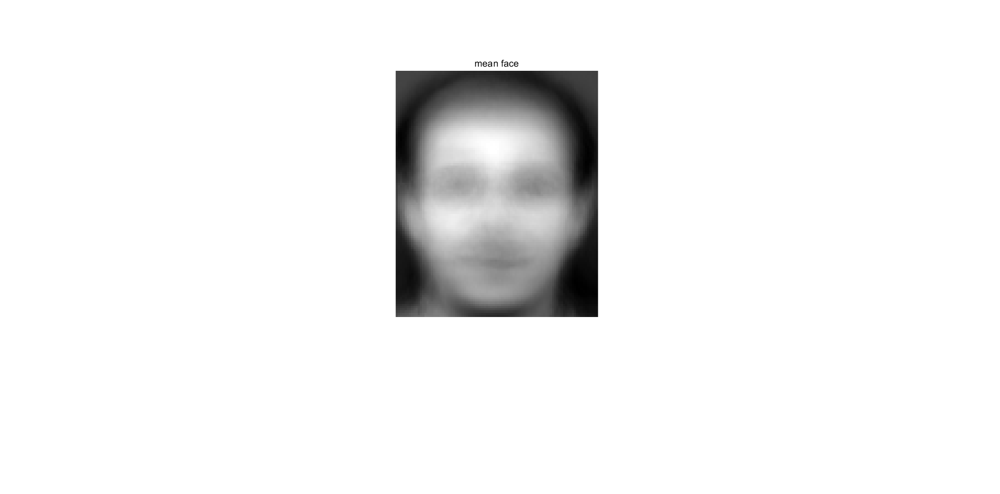
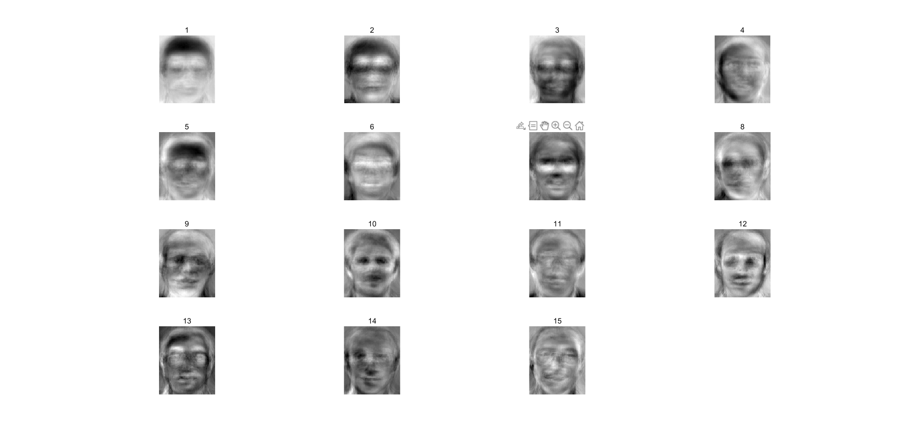
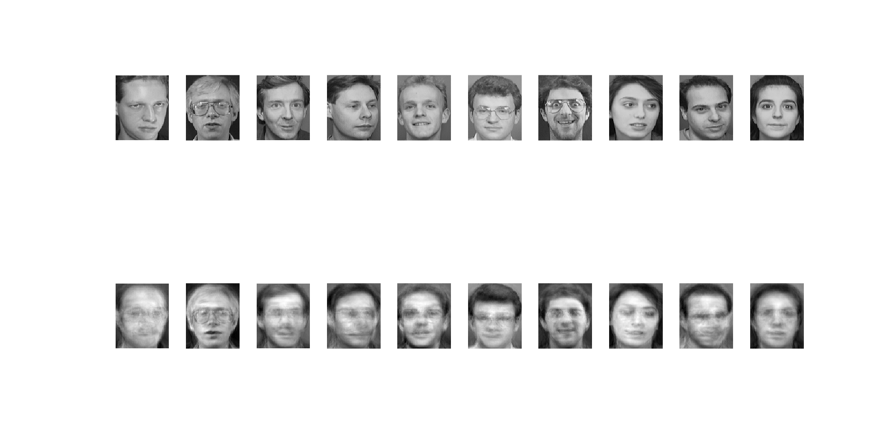
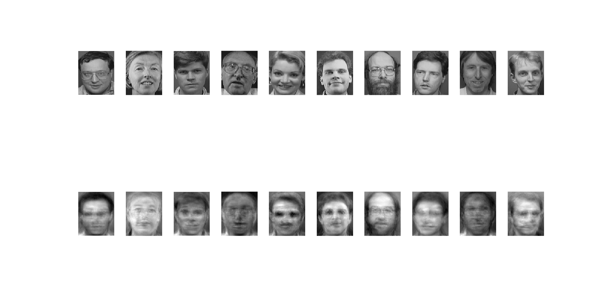

# HW3

*181220076 周韧哲*

均值脸程序与图像如下所示：

```matlab
filepath = "./att_faces/";
row = 112;
col = 92;
total_image = zeros(row,col);
count = 0;
for i=1:30
    for j=1:10
        image = imread(filepath+"s"+i+"/"+j+".pgm");
        image = im2double(image);
        total_image = total_image + image;
        count = count + 1;
    end
end
mean_image = mat2gray(total_image/count);
imshow(mean_image);
title("mean face");
```



特征脸和重构脸的程序如下：

```matlab
filepath = "./att_faces/";
row = 112;
col = 92;
image_matrix = zeros(row*col, 240);
count = 0;
for i=1:30
    for j=1:8
        image = imread(filepath+"s"+i+"/"+j+".pgm");
        image = im2double(image);
        image = reshape(image,[row*col, 1]);
        count = count + 1;
        image_matrix(:,count) = image;
    end
end
mean_image = mean(image_matrix,2);   
z_matrix = image_matrix - mean_image;    %(10304,240)
corr_matrix = z_matrix.' * z_matrix;
[V, D] = eig(corr_matrix);
[d, index] = sort(diag(D),'descend');
feature_array = V(:,index);             % sorted feature vector
max_num = 40;
% feature vectors
feature_array = z_matrix * feature_array(:,1:max_num);   %(10304,40)
figure(1);
for i=1:15
    subplot(4, 4, i);
    imshow(mat2gray(reshape(feature_array(:,i),[row,col])));
    title(i);
end

% normalize feature vectors
norm_feature = zeros(size(feature_array));
for i=1:max_num
    norm_feature(:,i) = feature_array(:,i)/norm(feature_array(:,i));
end

% 重构前10个志愿者的第10张人脸
show_n = 10;
figure(2);
for i=1:show_n
    image = imread(filepath+"s"+i+"/"+10+".pgm");
    subplot(2,show_n,i), imshow(image);
    image = im2double(image);
    image = reshape(image,[row*col, 1]);
    zi = image - mean_image;  %(10304,1)
    yi = zeros(max_num, 1);   %(40,1)
    for j=1:max_num
        yi(j,:) = norm_feature(:,j).'* zi;
    end
    yi_hat = norm_feature * yi + mean_image;
    subplot(2,show_n,show_n+i), imshow(mat2gray(reshape(yi_hat,[row,col])));
end

% 重构后10个志愿者的人脸
figure(3);
for i=1:show_n
    image = imread(filepath+"s"+(i+30)+"/"+1+".pgm");
    subplot(2,show_n,i), imshow(image);
    image = im2double(image);
    image = reshape(image,[row*col, 1]);
    zi = image - mean_image;  %(10304,1)
    yi = zeros(max_num, 1);   %(40,1)
    for j=1:max_num
        yi(j,:) = norm_feature(:,j).'* zi;
    end
    yi_hat = norm_feature * yi + mean_image;
    subplot(2,show_n,show_n+i), imshow(mat2gray(reshape(yi_hat,[row,col])));
end
```

前15张特征脸如下图：



对前10位志愿者的第10幅重构图像对比如下图：



对后10位志愿者的重构图像对比如下图：



可以看出，重构后基本上恢复了人脸的重要特征。