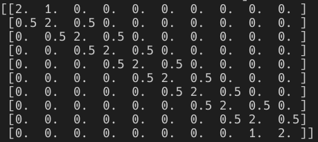
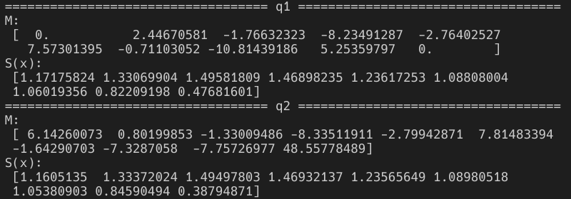
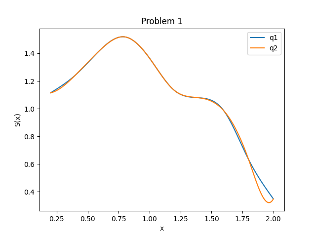
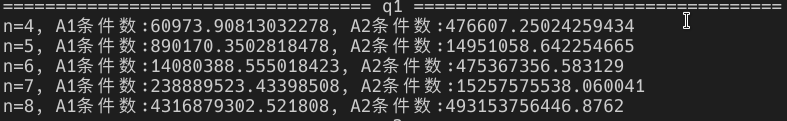
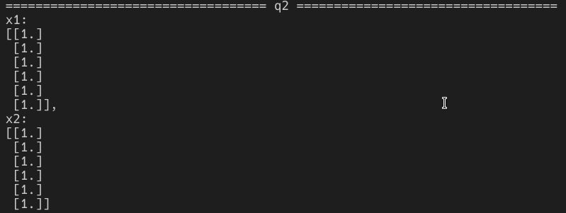
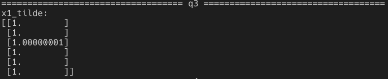
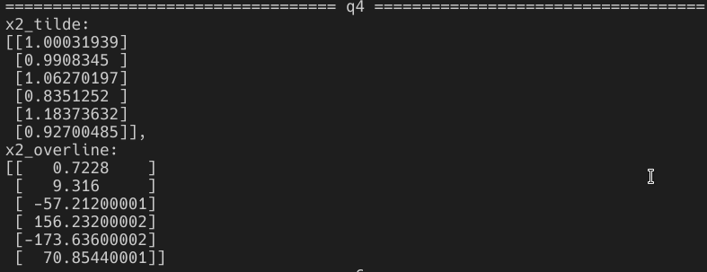
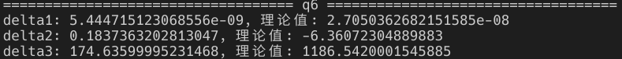

# 计算方法实习题

**181220076 周韧哲**

本实验使用的计算机为联想拯救者2019，cpu为Intel Core i5-9300HF @ 8x 4.1GHz，使用的语言为python3.8。命令行输入`python ps1.py`可得到第一题的运行结果，输入`python ps2.py`可得到第二题的运行结果。

## Problem1

### q1

首先定义变量，由于这里的$h,\mu,\lambda$都是定值，所以就不写成数组形式。然后计算二阶差商，并且通过三阶差商计算$d$。

```python
x = np.arange(0.2, 2.2, 0.2)   
fx = np.array([1.11398,1.24177,1.42303,1.51860,1.36437,1.13202,1.07845,0.98431,0.63207,0.34783])
h = 0.2
mu = 0.5
lam = mu
#计算差商与d
diff2 = []                    #二阶差商
d = [] 
m0, mn = 0.0, 0.0             #M0与Mn    
for i in range(x.shape[0]-1):
    diff2.append((fx[i+1]-fx[i])/h)
for i in range(x.shape[0]-2):
    d.append(6*(diff2[i]-diff2[i+1])/(x[i]-x[i+2]))

#按照slides中的矩阵形式来构造三角矩阵A和目标向量d
A = np.zeros((x.shape[0]-2,x.shape[0]-2))    
for i in range(A.shape[0]):
    A[i][i] = 2
    if i==0:
        A[i][i+1] = lam
    elif i==A.shape[0]-1:
        A[i][i-1] = mu
    else:
        A[i][i-1] = mu
        A[i][i+1] = lam
d = np.array(d)
d[0] = d[0] - mu*m0
d[1] = d[1] - lam*mn
```

然后就可以用追赶法求解$Ax=d$，我将追赶法封装在函数`tdma`中，首先根据递推公式计算$\beta$，然后计算$y$，最后求出$x$。

```python
#追赶法求解Ax=F
def tdma(A, F):
    beta, y, x = [], [], []
    for i in range(F.shape[0]-1):
        if i==0:
            beta.append(A[i][i+1]/A[i][i])
        else:
            beta.append(A[i][i+1]/(A[i][i]-A[i][i-1]*beta[-1]))
    for i in range(F.shape[0]):
        if i==0:
            y.append(F[i]/A[i][i])
        else:
            y.append((F[i]-A[i][i-1]*y[-1])/(A[i][i]-A[i][i-1]*beta[i-1]))
    for i in range(F.shape[0]-1, -1, -1):
        if i==F.shape[0]-1:
            x.append(y[i])
        else:
            x.append(y[i]-beta[i]*x[-1])
    return np.array(x[::-1])
```

最后计算出$M$后，就可以写出插值函数，从而计算给定$x$的函数值$S(x)$：

```python
M = tdma(A, d)
M = np.insert(M, [0], 0)
M = np.append(M, [0], 0)
Sx = calc(x, fx, M, np.array([0.2*i+0.1 for i in range(1,10)]))
```

`calc`函数如下：

```python
#计算插值函数值
def calc(x, fx, M, target):
    global h
    res = []
    for t in target:
        for i in range(x.shape[0]-1, -1, -1):
            #从x的后面开始循环，找到一个t属于[xi,xi+1)
            if t==x[i]:
                res.append(fx[i])
                break
            if t > x[i]:
                assert i!=x.shape[0]-1
                S = M[i]*(x[i+1]-t)**3/(6*h) + M[i+1]*(t-x[i])**3/(6*h) +\
                    (fx[i]-M[i]*h**2/6)*(x[i+1]-t)/h + (fx[i+1]-M[i+1]*h**2/6)*(t-x[i])/h
                res.append(S)
                break
    return np.array(res)
```

### q2

如同第一问，`tdma`和`calc`函数可以复用，变量定义大致如同第一问，如下：

```python
#计算差商与d
diff2 = []
d = []
d_fx0, d_fxn = 0.20271, 1.55741
for i in range(x.shape[0]-1):
    diff2.append((fx[i+1]-fx[i])/h)
d.append(6/h*(diff2[0]-d_fx0))
for i in range(x.shape[0]-2):
    d.append(6*(diff2[i]-diff2[i+1])/(x[i]-x[i+2]))
d.append(6/h*(d_fxn-diff2[-1]))

#按照slides中的矩阵形式来构造三角矩阵A和目标向量d
A = np.zeros((x.shape[0],x.shape[0]))
for i in range(A.shape[0]):
    A[i][i] = 2
    if i==0:
        A[i][i+1] = 1
    elif i==A.shape[0]-1:
        A[i][i-1] = 1
    else:
        A[i][i-1] = mu
        A[i][i+1] = lam
d = np.array(d)
```

A矩阵如下图所示：



最终，两个小题的结果如下：



使用了1800个点来绘制图像：

```python
plot_x = np.array([0.2+0.001*i for i in range(1,1800)])
plot_y = calc(x, fx, M, plot_x)
plt.plot(plot_x, plot_y, label='q2')
```

最终图像如下，蓝色为第一小题的曲线，橙色为第二小题的曲线。



可以看出，两者除了在端点处外都几乎拟合得一样。自然边界条件的约束了二阶导数，导致曲线更加平滑。

### 分析总结

经过重复运行20次，得到第一小题的cpu时间约为$0.00016(\pm0.00003)$秒，第二小题的cpu时间约为$0.00013(\pm0.00004)$秒，两者运行时间相差不大，第二种约束下的运行时间稍微快一点。

在这次实验中，可以看出自然边界条件的约束可以导致更光滑的插值函数，因为自然边界条件的约束了二阶导数。而且用追赶法求解三角方程是一种很快速的办法。


## Problem2

首先定义不同的线性方程：

```python
def get_A(n, _type):
    A = np.zeros((n+1, n+1))
    for i in range(n+1):
        x = 1 + 0.2*i
        for j in range(n+1):
            A[i][j] = (1+0.2*i)**j if _type==1 else 1/(i+j+1)
    b = np.sum(A, axis=1, keepdims=True)
    return A, b
```

### q1

q1的代码和结果如下：

```python
for n in range(4, 9):
    A1, _ = get_A(n, 1)
    A2, _ = get_A(n, 2)
    print(f"n={n}, A1条件数:{np.linalg.cond(A1,2)}, A2条件数:{np.linalg.cond(A2,2)}")
```



容易看出，随着n的增大，矩阵的条件数增大，矩阵病态增大。且n固定时，A2比A1的条件数更大。

### q2

q2的代码和结果如下：

```python
A1, b1 = get_A(5, 1)
A2, b2 = get_A(5, 2)
A1_ori = deepcopy(A1)     #保存初始的A1
A2_ori = deepcopy(A2)     #保存初始的A2
x1 = np.linalg.solve(A1, b1)
x2 = np.linalg.solve(A2, b2)
print(f"x1:\n{x1},\nx2:\n{x2}")
```



### q3

q3的代码和结果如下：

```python
#对A1扰动
A1[1][1] += 1e-12
A1[5][5] += 1e-12
A1_delta = A1 - A1_ori        #保存delta A1
x1_tilde = np.linalg.solve(A1, b1)
print(f"x1_tilde:\n{x1_tilde}")
```



在对A1增加扰动时，解向量$\tilde{x}_1$相比原解几乎没有变化。

### q4

q4的代码和结果如下：

```python
A2[1][1] += 1e-7
A2[5][5] += 1e-7
A2_delta = A2 - A2_ori              #保存delta A2
x2_tilde = np.linalg.solve(A2, b2)
A2, b2 = get_A(5, 2)
b2_ori = deepcopy(b2)               #保存初始的b2
b2[5][0] += 1e-4
b2_delta = b2 - b2_ori              #保存delta b2
x2_overline = np.linalg.solve(A2, b2)
print(f"x2_tilde:\n{x2_tilde},\nx2_overline:\n{x2_overline}")
```



容易看出，对A2或b2施加的扰动造成了解的明显变化。

### q5

可以知道A1和A2的条件数都很大，这两个线性方程组都是病态的。

+ 在对A1增加扰动时，解向量$\tilde{x}_1$相比原解几乎没有变化，这是因为虽然A1的条件数很大，但扰动很小，仍不足以造成解的明显变化。
+ 对A2增加扰动时，解向量$\tilde{x}_2$变化较大，因为A2的条件数很大，且A2的扰动也比A1更大，因此在A2的条件数很大的时候，这么一个微小的扰动就能造成解的很大变化。
+ 而对b2增加扰动时，解向量$\overline{x}_2$相比原解变化巨大，也是因为A2的条件数很大，线性方程组的病态程度很高。

结论：当线性方程组的系数矩阵条件数很大时，该方程组是病态的，对系数矩阵或者常数项施加一些微小的扰动，就会导致解的千差万别。

### q6

q6的代码和结果如下：

```python
delta1 = np.linalg.norm(x1-x1_tilde, ord=np.inf)/np.linalg.norm(x1, ord=np.inf)
delta2 = np.linalg.norm(x2-x2_tilde, ord=np.inf)/np.linalg.norm(x2, ord=np.inf)
delta3 = np.linalg.norm(x2-x2_overline, ord=np.inf)/np.linalg.norm(x2, ord=np.inf)
g = lambda x: x/(1-x)
_delta1 = g(np.linalg.cond(A1_ori, np.inf)*np.linalg.norm(A1_delta, ord=np.inf)/np.linalg.norm(A1_ori, ord=np.inf))
_delta2 = g(np.linalg.cond(A2_ori, np.inf)*np.linalg.norm(A2_delta, ord=np.inf)/np.linalg.norm(A2_ori, ord=np.inf))
_delta3 = np.linalg.cond(A2_ori, np.inf)*np.linalg.norm(b2_delta, ord=np.inf)/np.linalg.norm(b2_ori, ord=np.inf)
print(f"delta1: {delta1}, 理论值: {_delta1}")
print(f"delta2: {delta2}, 理论值: {_delta2}")
print(f"delta3: {delta3}, 理论值: {_delta3}")
```



可以看到，第一个式子的计算值和理论值较为接近。而第二个式子的理论值是负数，这是因为$\|A_2^{-1}\|_{\infty}\|\delta A_2\|_\infty>1$。而第三个式子的计算值比理论值小多了，说明其理论值是一个较松的bound。

### 分析总结

经过重复运行20次，得到该题的总cpu时间约为$0.002(\pm0.0001)$秒。通过这一实验，可以总结出：

+ 当线性方程组的系数矩阵条件数很大时，该方程组是病态的，对系数矩阵或者常数项施加一些微小的扰动，就会导致解的千差万别。且条件数越大，方程病态程度越高，其解越容易受到微小扰动的影响。
+ 因为计算机无法精确存储浮点数，所以如果使用计算机求解条件数很大、病态程度很高的线性方程组时，需要仔细考虑扰动对解的影响，并可以使用一些更加鲁棒与稳定的数值方法来求解。

